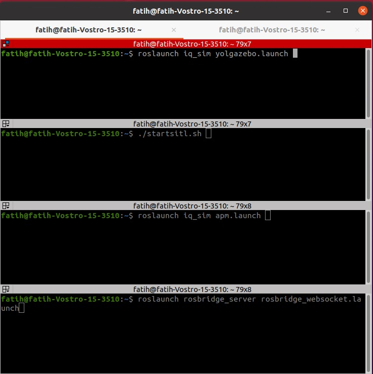
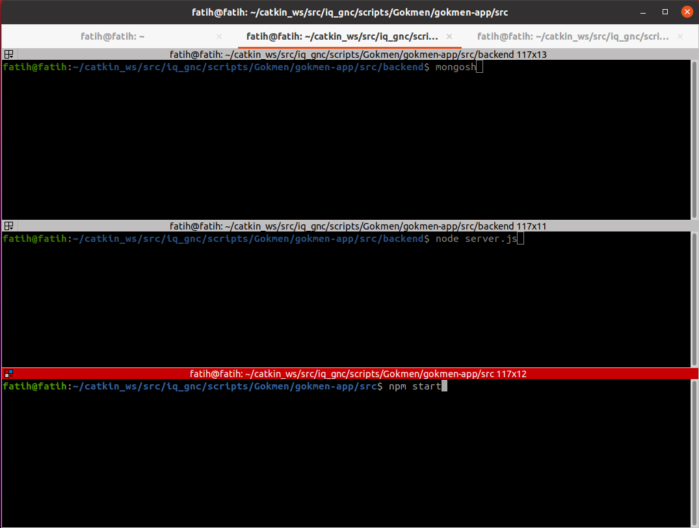
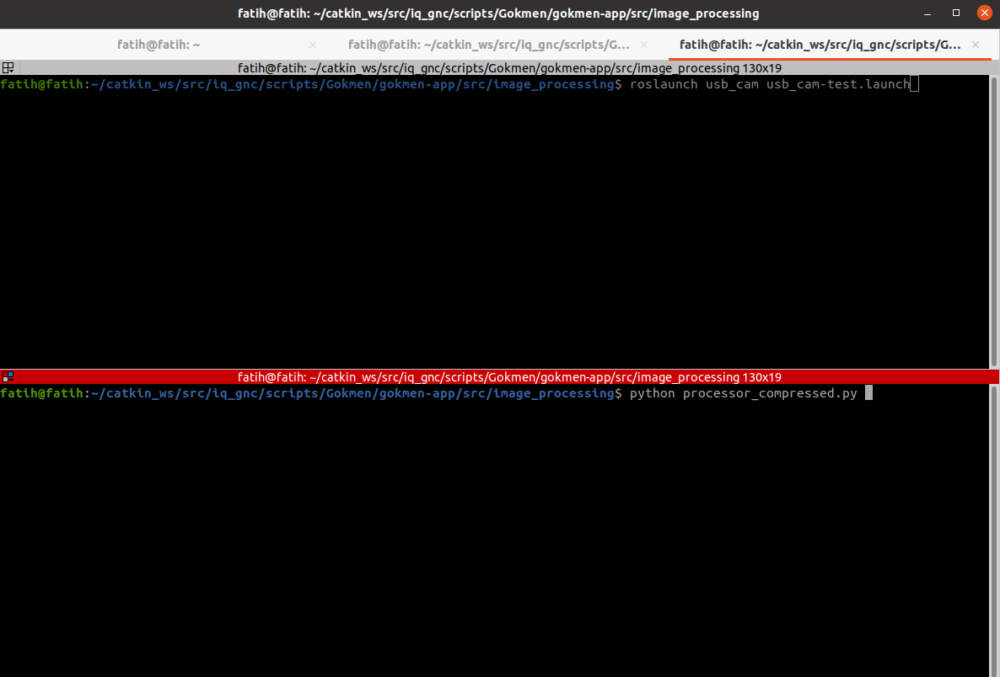

**Nodejs 20 indirmek için:**

```
sudo apt-get update
sudo apt-get upgrade
sudo apt-get install curl
curl -fsSL https://deb.nodesource.com/setup_20.x | sudo -E bash -
```

sonra nodejs kurmaya başlayabilirsin:

```
sudo apt-get install nodejs
```

sürümü kontrol et:

```
node -v
npm -v
```

şimdi proje oluşturmak için:

```
mkdir Gokmen
cd Gokmen
npm init
```
Aynı dosyanın içerisinde şimdi:

```
npx create-react-app gokmen-app
cd gokmen-app
npm install socket.io
npm install express
npm install roslib
```

App.js kodlarını düzenledikten sonra başlatmak için:

```
npm start
```

**Ubuntu 20.04 için Mongodb kurulumu**:

```
sudo apt-get install gnupg curl
```
mongodb 7.0 için :

```shell
curl -fsSL https://pgp.mongodb.com/server-7.0.asc | \
   sudo gpg -o /usr/share/keyrings/mongodb-server-7.0.gpg \
   --dearmor
```
uygun sürümü ubuntu deposuna ekleme:
```shell
echo "deb [ arch=amd64,arm64 signed-by=/usr/share/keyrings/mongodb-server-7.0.gpg ] https://repo.mongodb.org/apt/ubuntu focal/mongodb-org/7.0 multiverse" | sudo tee /etc/apt/sources.list.d/mongodb-org-7.0.list
```
mongoDB kurulumu:
```shell
sudo apt-get install -y mongodb-org
```
kontrol:
```shell
sudo systemctl start mongod
```
mongodb başlatmak için:
```
mongosh
use gokmendatabase
```
server çalıştırmak ve mongoDB ile bağlantıyı kontrol etmek için:
```
cd ~/catkin_ws/src/iq_gnc/scripts/Gokmen/gokmen-app/src/backend
node server.js
```
ilerki süreçte dosyaların kurulumları yapıldıktan sonra flask ile web arasondaki bağlantıyı sağlamak için Bunun yerine web üzerindeki yapay zekayı başlat butonuna da basabilirsiniz:
```
curl -X POST http://localhost:5000/start-ai-model
```
Ek olarak eskiden ``` roslaunch usb_cam usb_cam-test.launch ``` kullanıyordum. launch dosyasını düzenledim sadece topic yayınlanması için:
```
cd ~/catkin_ws/src/iq_gnc/scripts/Gokmen/gokmen-app/src/image_processing
roslaunch usb_cam-test.launch
```

Webi kolay başlatma yöntemi:
```
find ~/ -type f -path '*/Web-PG/web.sh' -exec mv {} ~/ \;
chmod +x web.sh
./web.sh
```

<p align="center">
  
  
     
</p>
